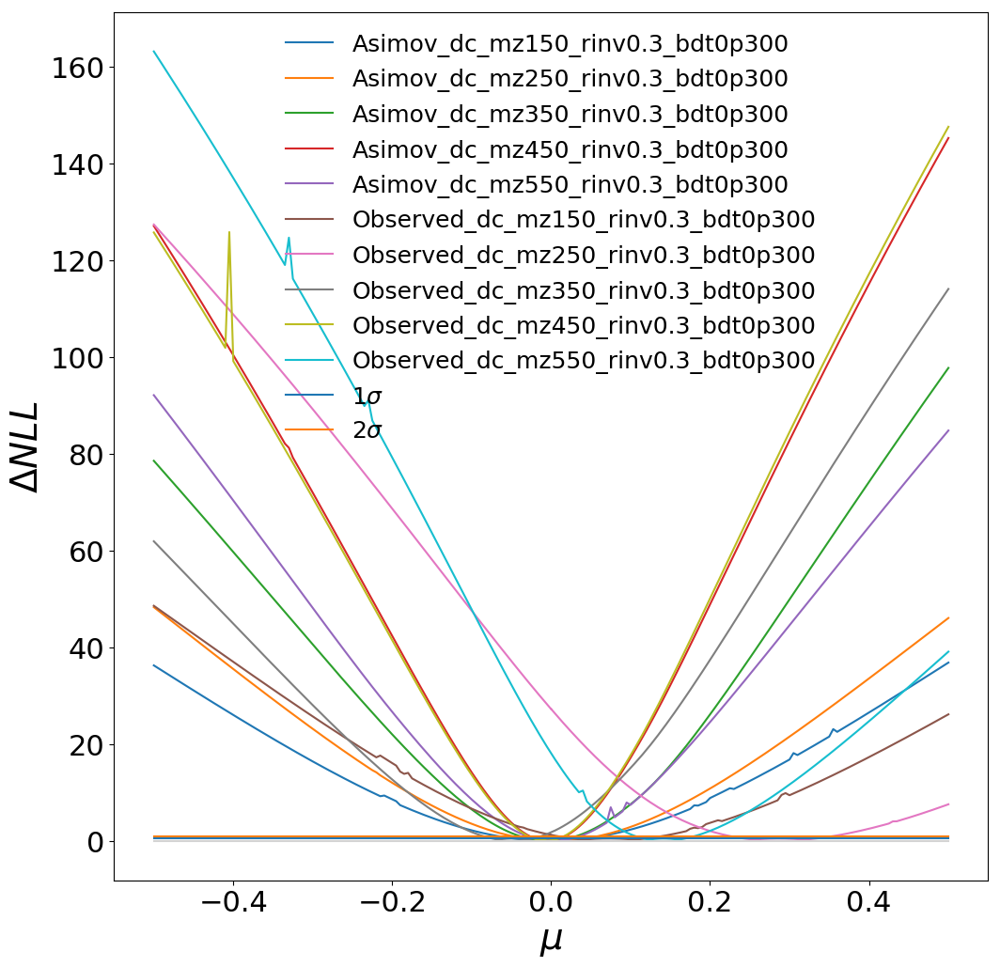
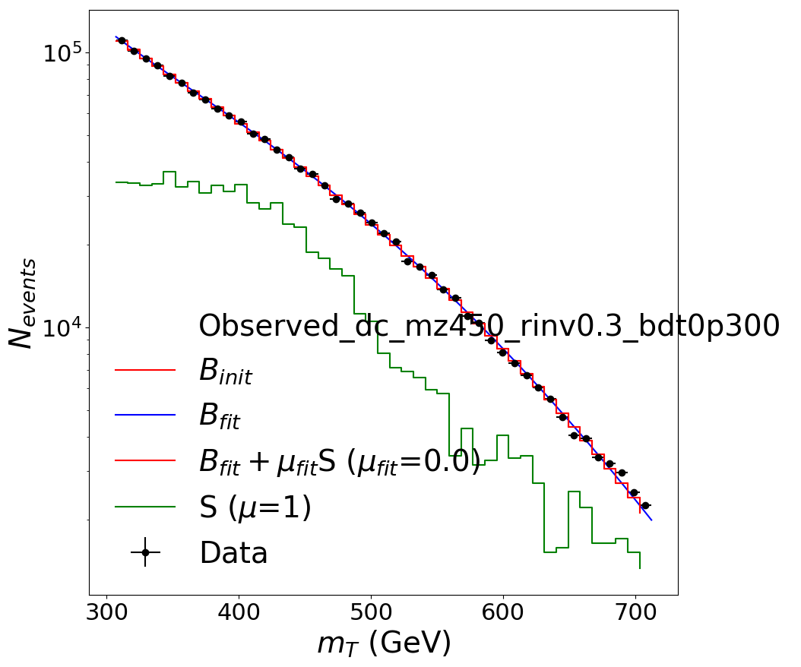
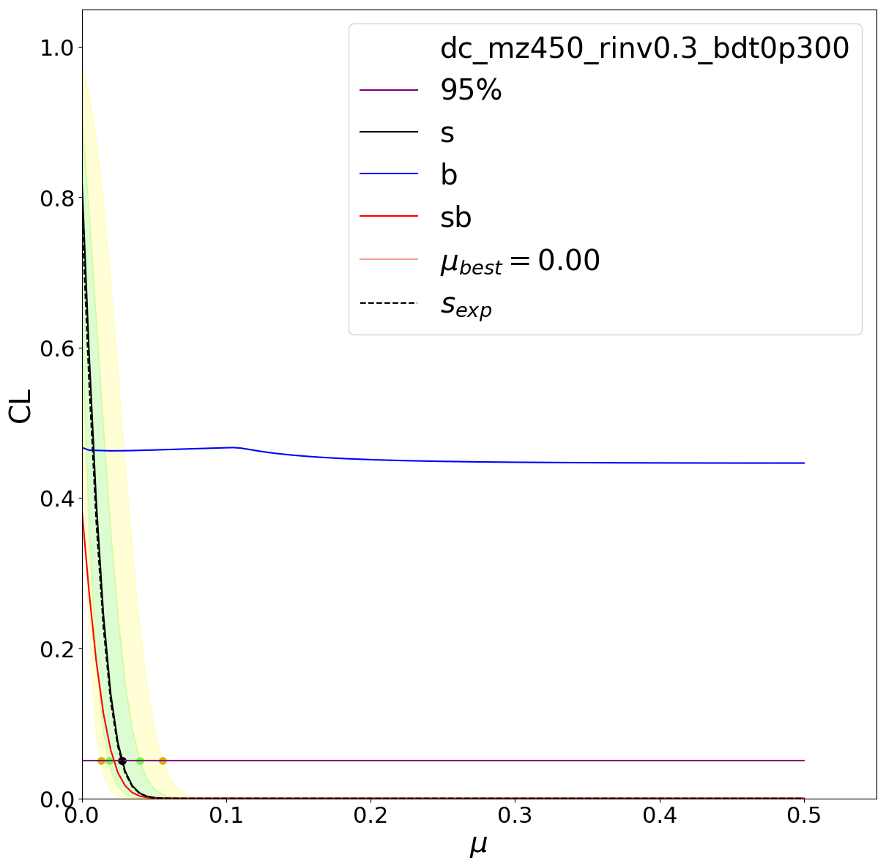
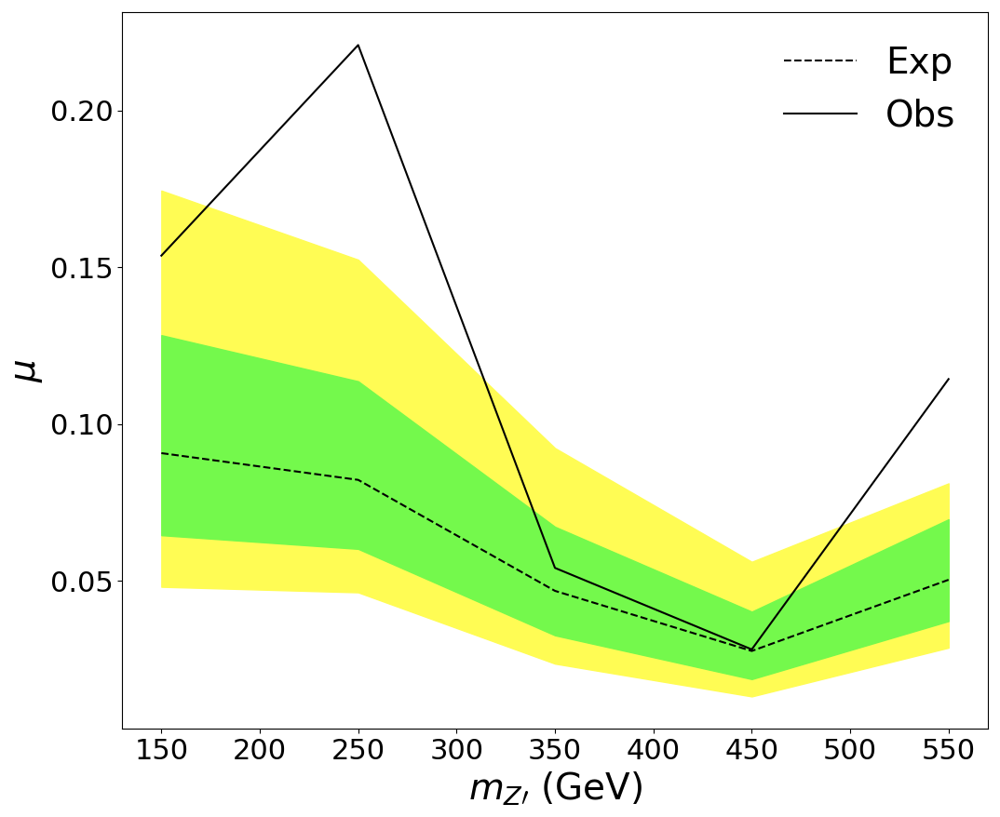

# Limits for the SVJ boosted analysis

## Setup 

1. Follow the `combine` instructions: https://cms-analysis.github.io/HiggsAnalysis-CombinedLimit/#setting-up-the-environment-and-installation . Current results are using CC7 release `CMSSW_10_2_X`, tag v8.2.0.

2. Clone this repository:

```bash
cd $CMSSW_BASE/src
git clone git@github.com:boostedsvj/svj_limits.git boosted/svj_limits
cd boosted/svj_limits
```

## Generating the datacards

You first need a `histograms.json` file; see https://github.com/boostedsvj/svj_uboost .

Then:

```bash
python cli_boosted histograms.json
```

## Running the likelihood scans

For all BDT working points and all signals, do simply:

```bash
python cli_boosted.py likelihood_scan_multiple dc_Dec07/*.txt
python cli_boosted.py likelihood_scan_multiple dc_Dec07/*.txt --asimov
```

Selecting BDT working points and particular signals is easily done via wildcard patterns to select the right datacards:

```bash
python cli_boosted.py likelihood_scan_multiple dc_Dec07_minmt300/dc_mz*rinv0.3*bdt0p{0,3,5}*.txt --asimov --minmu -.5 --maxmu .5 -n 100
```

Note also the options `--minmu` and `--maxmu` which handle the range of the signal parameter to scan, and the option `-n` which controls the number of points in the range.


## Plotting


To do all plots at once (takes a while):

```bash
python quick_plot.py allplots scans_Dec07/*.root
```


ΔNNL as a function of mu:

```bash
python quick_plot.py muscan scans_Dec07/*bdt0p3*.root
```




MT histogram, with bkg-only fit and and sig+bkg fit:

```bash
python quick_plot.py mtdist scans_Dec07/higgsCombineObserved_dc_mz450_rinv0.3_bdt0p300.MultiDimFit.mH120.root
```




CLS:

```bash
python quick_plot.py cls scans_Dec07/higgsCombineObserved_dc_mz450_rinv0.3_bdt0p300.MultiDimFit.mH120.root scans_Dec07/higgsCombineAsimov_dc_mz450_rinv0.3_bdt0p300.MultiDimFit.mH120.root
```




Brazil band (relies on good interpolation; always check the CLs plots to double check!):

```bash
python quick_plot.py brazil scans_Dec07/higgsCombine*bdt0p3*.root
```


